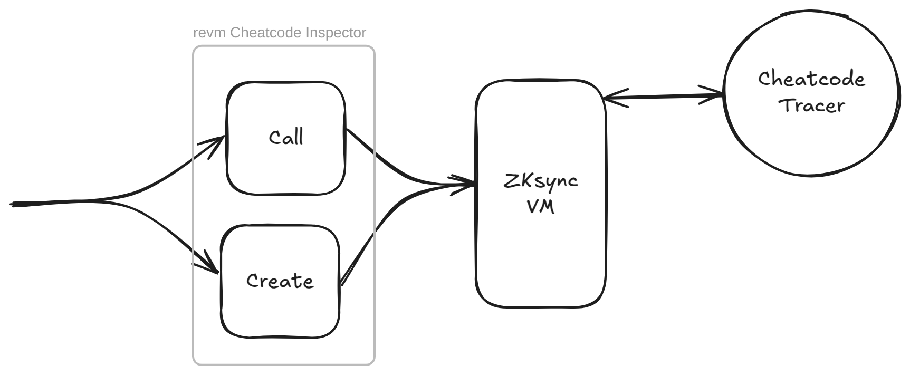
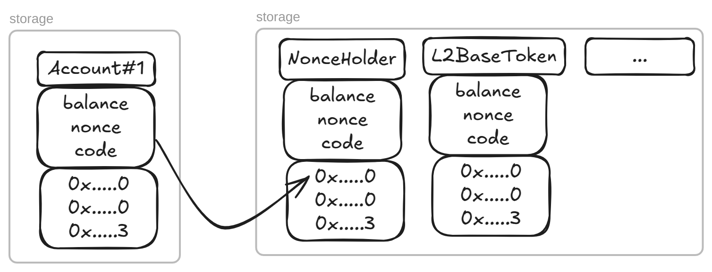
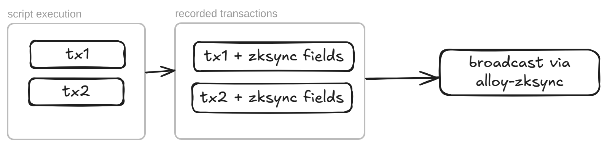

# Architecture Design


## Strategy Pattern
The functionality has been developed with the strategy pattern to keep the custom code disjoint from the place of use. This keeps the merge conflicts to a minimum when performing upstream merges.

A strategy for example contains a stateless runner, which encapsulates custom logic, and a stateful context that stores the necessary data.
Thus, a runner can be freely cloned as needed, however the data/context must only be cloned when a fresh/non-persistent operation is required.

```rs
pub struct CheatcodeInspectorStrategy {
    /// Strategy runner.
    pub runner: &'static dyn CheatcodeInspectorStrategyRunner,
    /// Strategy context.
    pub context: Box<dyn CheatcodeInspectorStrategyContext>,
}
```

The strategy is defined on the struct where behavior diverges from EVM scope and is used as follows:

```rs
struct Cheatcodes {
    /// The behavior strategy.
    pub strategy: CheatcodeInspectorStrategy,

    // ...
}

impl Cheatcodes {
    fn create() {
        // original EVM scope code
    }
}
```

The EVM code would then be moved to an EVM strategy and a ZKsync strategy would be created to house the custom logic:

```rs
trait CheatcodeInspectorStrategyRunner {
    fn do_something(&self, ctx: &mut dyn CheatcodeInspectorStrategyContext);
}
pub struct EvmCheatcodeInspectorStrategyRunner;

impl CheatcodeInspectorStrategyRunner for EvmCheatcodeInspectorStrategyRunner {
    fn do_something(&self, ctx: &mut dyn CheatcodeInspectorStrategyContext) {
        // original EVM scope code
    }
}

impl CheatcodeInspectorStrategyRunner for ZksyncCheatcodeInspectorStrategyRunner {
    fn do_something(&self, ctx: &mut dyn CheatcodeInspectorStrategyContext) {
        // new ZKsync scope code
    }
}
```

Now at the point of use we can seamlessly delegate the logic to our strategy object, which would either be containing the EVM or the ZKsync strategy invariant:

```rs
struct Cheatcodes {
    /// The behavior strategy.
    pub strategy: CheatcodeInspectorStrategy, // Will either be EVM or ZKsync strategy, decided during object creation

    // ...
}

impl Cheatcodes {
    fn create() {
        // delegate behavior to strategy
        self.strategy.runner.do_something(self.strategy.context.as_mut());
    }
}
```

## `forge test`

To allow interoperatability with native foundry behavior, foundry-zksync leverages the [Cheatcodes](../crates/cheatcodes/src/inspector.rs) struct which taps into the revm inspector trait. The trait exposes revm inspector's hooks, e.g. `call`, `call_end`, `create`, etc. that practically provide a flow where each transaction is executed sequentially through these hooks. This allows us to intercept the transactions on the revm level, and dispatch them to the ZKsync VM.

Anytime a transaction is identified in the `call` or `create` hooks, we spin up a new ZKsync VM with meaningful defaults, and execute the transaction there.
In certain cases we track interesting information that foundry might need to satisfy constraints for many of its cheatcodes. This is achieved via the [CheatcodeTracer](../crates/zksync/core/src/vm/tracers/cheatcode.rs), which implements the `DynTracer` trait. `CheatcodeTracer` also contains the glue code necessary to make it possible to run the dispatched transaction.



Upon execution, we simply convert the ZKsync VM result into what revm expects and skip the opcode execution within the revm itself. The entire execution happens in `zksync_try_create` and `zksync_try_call` of the `ZksyncCheatcodeInspectorStrategyRunner`.

More details are provided in the [book](https://foundry-book.zksync.io/zksync-specifics/execution-overview).

### Storage Translations
In order for the revm storage to be correctly utilized in ZKsync VM, we perform storage migrations to translate EVM information like balance, nonce, code storage, etc. to their respective ZKsync VM counterparts. This step is only executed once per VM switch in both `EVM <> ZKsync VM` and also in `ZKsync VM <> EVM` scenarios.



⚠️ Note: Almost all cheatcodes are thus supported out of the box since we let foundry handle cheatcode application before the transaction is intercepted. Certain cheatcodes (e.g. `expectEmit`) however require additional work to be done as they must follow into the ZKsync VM.

⚠️ Note: The presence of `Cheatcode` inspector is required within a runner (specified in the builder config) to support running transactions in ZKsync VM.

## `forge script`

Forge scripts are generally executed in three stages:
1. Initial Execution
2. Simulation
3. Broadcast

During initial execution we execute the script just like a test, while we record individual transactions as they occur using the `vm.startBroadcast() / vm.stopBroadcast()` cheatcodes. These transactions are recorded in the normal foundry way, however we make use of alloy's `OtherFields` struct to encode additional `EIP-712` fields like `factory_deps` and `paymaster_params` under the key specified by `ZKSYNC_TRANSACTION_OTHER_FIELDS_KEY` constant.

These fields are then decoded out when the transaction is built for `alloy-zksync`. 



## Traces
Foundry uses `CheatcodesExecutor` trait to record console logs and traces. For our purpose we've added the `trace_zksync` method to the trait. This method takes care of appending the traces returned from the ZKsync VM into the format used by foundry. This is done by wrapping foundry's `TraceInspector` in our own [`TraceCollector`](../../crates/zksync/inspectors/src/trace.rs) and calling its underlying method to record the `call_traces` list as returned from the bootloader. 

See [book](https://foundry-book.zksync.io/zksync-specifics/limitations/traces) for more information.

## Nonces
Foundry does a lot of nonce manipulation under the hood while recording transactions and around scripts. This could often get tricky to understand and lead to incorrect assumptions, or in worst case - bugs.

 This behavior is stated in-depth in the [book](https://foundry-book.zksync.io/zksync-specifics/developer-guide/nonces).  

## `cast`
The cast family of subcommands are treated as one-off scripts that are stateless, hence do not benefit from the strategy pattern. These usually contain the zksync logic in their own module and the behavior is invoked from the main point of entry of the respective subcommand. 

See [cast call](../../crates/cast/src/cmd/call/zksync.rs).