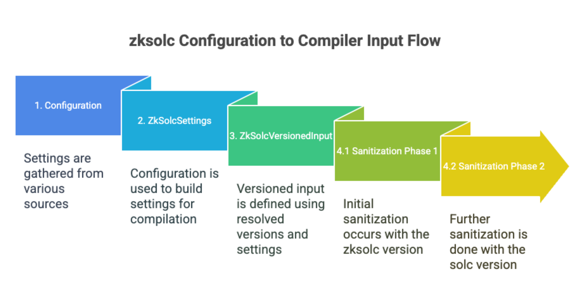

# Updating zksolc in Foundry-ZKSync: A Guideline

When a new `zksolc` version is released, making it available in Foundry involves more than simply bumping the version number. Backward compatibility must be carefully considered. For more information about the defined compiler policy you can check the [Foundry-ZKSync compiler section](https://foundry-book.zksync.io/zksync-specifics/compilation-overview?highlight=policy#compiler-support-policy). 

### Process Overview

1. **Add New Versions**:
    - In [`crates/zksync/compilers/src/compilers/zksolc/mod.rs`](https://github.com/matter-labs/foundry-zksync/blob/3f8025f53f2c4cffe6ac4b43a3e20d4ebf993c6e/crates/zksync/compilers/src/compilers/zksolc/mod.rs#L415), add the new `zksolc` version to the list of supported versions. This will make it the default (latest) version.
2. **Review Release Notes and Version Commits**:
    - Consult the `zksolc` release notes ([era-compiler-solidity/releases](https://github.com/matter-labs/era-compiler-solidity/releases)) and examine all version commits to identify potential breaking changes not explicitly mentioned in the release notes.
3. **Check Supported `solc` Versions**:
    - Verify the new `solc` versions supported by `zksolc` and confirm the existence of the corresponding `era-compiler-solc` fork in [era-solidity/releases](https://github.com/matter-labs/era-solidity/releases).
    - Add the supported `solc` version in [`crates/zksync/compilers/src/compilers/zksolc/mod.rs`](https://github.com/matter-labs/foundry-zksync/blob/3f8025f53f2c4cffe6ac4b43a3e20d4ebf993c6e/crates/zksync/compilers/src/compilers/zksolc/mod.rs#L443).
4. **Incorporate New Compiler Options**:
    - In the [`settings.rs`](https://github.com/matter-labs/foundry-zksync/blob/main/crates/zksync/compilers/src/compilers/zksolc/settings.rs) file, add any new compiler options. Ensure the settings accommodate all supported compilers and include optional ad-hoc sanitizing when building `ZkSolcInput` from the settings ([`input.rs`](https://github.com/matter-labs/foundry-zksync/blob/3f8025f53f2c4cffe6ac4b43a3e20d4ebf993c6e/crates/zksync/compilers/src/compilers/zksolc/input.rs#L126)).

### Handling Specific Changes: Examples

- **New Error Types**:
    - If a new error type is added (e.g., `Ripemd160` Error as seen in [era-compiler-solidity/pull/276/files](https://github.com/matter-labs/era-compiler-solidity/pull/276/files)), incorporate the new error type into the `ErrorType` settings enum.
- **Option Renaming**:
    - When options are renamed (e.g., `fallbackToOptimizingForSize` to `sizeFallback` and `LLVMOptions` to `llvmOptions` as seen in [era-compiler-solidity/commit/62f0ce7dc6c5050e3a464a6b453d493e07384f53](https://github.com/matter-labs/era-compiler-solidity/commit/62f0ce7dc6c5050e3a464a6b453d493e07384f53)), rename the option in the config and CLI, while keeping an alias for the old one. In `ZkSettings/ZkSolcInput`, maintain both values as `Option`. Use `sizeFallback` internally and populate `fallbackToOptimizingForSize` during input sanitization for `zksolc` versions that require it. The same applies to `llvmOptions`.

### Testing and Submission

1. **Run Foundry Test Suite**:
    - Execute the complete Foundry test suite to ensure all tests pass. Pay particular attention to the compiler integration tests, which include checks for all supported versions ([`zksync_tests.rs`](https://github.com/matter-labs/foundry-zksync/blob/3f8025f53f2c4cffe6ac4b43a3e20d4ebf993c6e/crates/zksync/compilers/tests/zksync_tests.rs#L59)). Add new tests for any discovered edge cases.
2. **Submit a PR**:
    - Create a pull request with all the changes.

### Examples

For further clarification, you can review these compiler update examples:

1. [feat: add assemblycreate for warning suppression for zksolc 1.5.10](https://github.com/matter-labs/foundry-zksync/pull/840)
2. [feat: Add support for zksolc 1.5.12](https://github.com/matter-labs/foundry-zksync/pull/1002)

### Appendix: `zksolc` Configuration to Compiler Input Flow

Understanding the flow from Foundry settings to the final compiler input is crucial for reviewing changes and ensuring backward compatibility:

1. **Configuration**:
    - Configuration settings originate from sources like `foundry.toml` and command-line arguments, with dedicated ZKSync settings.
2. **ZkSolcSettings**:
    - The configuration is used to build `ZkSolcSettings`, which are used in the compilation flow.
3. **ZkSolcVersionedInput**:
    - During compilation, the `solc` version and sources are resolved. These, along with `ZkSolcSettings`, define the `ZkSolcVersionedInput`, which contains the sanitized `ZkSolcInput`.
4. **Sanitization**:
    - Sanitization occurs in two phases: first with the `zksolc` version during input creation, and then with the `solc` version immediately after. This ensures compliance with the Foundry compilers API, which pairs sources with compiler versions during version resolution. The `solc` version is used for pairing because different `solc` versions can be used for the same project, but only one `zksolc` version (stored in `ZkSolcSettings`) is defined. The call to sanitize uses the resolved `solc` version, necessitating the introduction of `zksolc` sanitization elsewhere.

### Summary

Updating `zksolc` in Foundry-ZKSync requires careful attention to backward compatibility. The process involves adding new versions, reviewing release notes, incorporating compiler options, and thorough testing. Understanding the configuration flow and sanitization process is essential for ensuring a smooth transition and maintaining the integrity of the compiler integration.