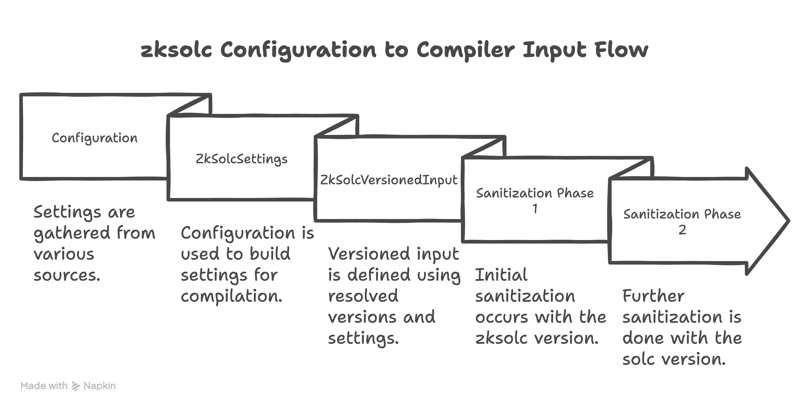

# `zksolc` Configuration to Compiler Input Flow

Foundry-ZKsync serves as a powerful tool for developing and interacting with Solidity smart contracts. A core function of this tool is compiling your Solidity code using the `zksolc` compiler. To provide flexibility and control over this process, Foundry-ZKsync allows users to specify various configuration settings through `foundry.toml` or command-line flags. These settings are then processed and ultimately translated into a structured input that the `zksolc` compiler understands and uses to perform the compilation.

Understanding the flow from Foundry settings to the final compiler input is crucial for reviewing changes and ensuring backward compatibility:

1. **Configuration**:
    - Configuration settings originate from sources like `foundry.toml` and command-line arguments, with dedicated ZKSync settings.
2. **ZkSolcSettings**:
    - The configuration is used to build `ZkSolcSettings`, which are used in the compilation flow.
3. **ZkSolcVersionedInput**:
    - During compilation, the `solc` version and sources are resolved. These, along with `ZkSolcSettings`, define the `ZkSolcVersionedInput`, which contains the sanitized `ZkSolcInput`.
4. **Sanitization**:
    - Sanitization occurs in two phases: first with the `zksolc` version during input creation, and then with the `solc` version immediately after. This ensures compliance with the Foundry compilers API, which pairs sources with compiler versions during version resolution. The `solc` version is used for pairing because different `solc` versions can be used for the same project, but only one `zksolc` version (stored in `ZkSolcSettings`) is defined. The call to sanitize uses the resolved `solc` version, necessitating the introduction of `zksolc` sanitization elsewhere.