# Foundry Upstream Merge Update Guide

This document describes the **process for integrating changes from the original Foundry repository (upstream) into our ZKsync-customized** version. 

## 🤔 Why upstream merging?

Upstream updating is a critical task that allows us to **benefit from Foundry's improvements and bug fixes while maintaining our customizations**. 


## 🛠️ Preparation

⚠️ **IMPORTANT**: This process requires **attention to detail and a clear understanding of the architectural differences** between our version and upstream. 

### Verification of Previous Updates

Before starting an upstream sync, make sure **commits from the previous update** ([see step 7](#7-individual-commit-incorporation)) have been included; otherwise, there **will be more merge conflicts than needed.**

### Upstream Repository Configuration

If this is your first time running this process, you'll need to configure the upstream repo to point to Foundry's:

```bash
git remote add upstream git@github.com:foundry-rs/foundry.git
```

## 🔄 Update Process

This process is a **recommendation based on previous collective experience of performing the process**. It's not a strict rule and you can adapt it as needed.

### Branch Naming Convention

Throughout this process, we use a **specific branch naming convention** to keep track of different steps:

| Branch Name | Purpose |
|-------------|---------|
| `upstream-<SHORT_COMMIT_HASH>` | Main tracking branch for the update process. Used to coordinate all the work. |
| `upstream-<SHORT_COMMIT_HASH>-merge` | Branch for resolving merge conflicts with upstream. |
| `upstream-<SHORT_COMMIT_HASH>-build` | Branch for fixing compilation errors after conflict resolution. |
| `upstream-<SHORT_COMMIT_HASH>-commits` | Branch for incorporating individual upstream commits into main. |

This is a diagram of the process:



### 1. Target Commit Selection

Visit the [Foundry repository](https://github.com/foundry-rs/foundry) and select a **target upstream commit** for the update. Generally, choose the latest `master` commit to get the latest features.
  
### 2. Tracking Branch Creation

Create a branch called `upstream-<SHORT_COMMIT_HASH>` and open a draft PR.

This PR is used to **track that the upstream update is in process** and to avoid conflicts with other PRs.

### 3. Merge Conflict Resolution

In this step, we will resolve the merge conflicts with the target upstream commit. For that:

1. **Create a branch** called `upstream-<SHORT_COMMIT_HASH>-merge`.
2. Pull the target upstream commit.
3. **Solve merge conflicts.**
4. Open a PR into `upstream-<SHORT_COMMIT_HASH>`.

#### **Important Considerations During Conflict Resolution**

1. **Common Cheatcodes**: The following files/constructors have been moved to `foundry-cheatcodes-common` crate (from their respective `foundry-cheatcodes` crate) to be used by the `foundry-zksync-core` crate.

| **Entity** | **Original** | **Current** |
| --- | --- | --- |
| `expect::{ExpectedCallData, ExpectedCallType, ExpectedCallTracker}`  | `foundry-cheatcodes::test::expect` | `foundry-cheatcodes-common::expect` |
| `record::{RecordAccess}`  | `foundry-cheatcodes::evm` | `foundry-cheatcodes-common::record` |
| `mock::{MockCallDataContext, MockCallReturnData}`  | `foundry-cheatcodes::evm::mock` | `foundry-cheatcodes-common::mock` |

2. **Strategy Pattern**: [PR #781](https://github.com/matter-labs/foundry-zksync/pull/781) introduces the **strategy pattern** where `Executor`, `CheatcodeInspector`, and Backend are **generalized into traits** with **both EVM and EraVM implementations**.
   - There are also several other pull requests which refactor the pattern quite a bit, so **don't use just that PR as reference**.
   -  We have to be on the **lookout for places where inline logic in upstream is replaced with a strategy trait call in zksync**. When getting a merge conflict in these cases, the inline logic changes must be implemented for the trait implementations.

3. **Dependency Updates**: `alloy-zksync` (https://github.com/popzxc/alloy-zksync) might need to be updated to use the alloy version used by foundry (Sample: https://github.com/popzxc/alloy-zksync/pull/39).

4. **ZKsync Telemetry**: The zksync-telemetry crate is used to capture internal metrics related to user behavior and performance. These changes are **intentionally maintained** in our fork and **must not be removed** during conflict resolution. Be especially mindful when resolving conflicts involving telemetry logic. For reference, see the relevant changes introduced in [PR #1008](https://github.com/matter-labs/foundry-zksync/pull/1008/files).

5. **Release Workflow**: We maintain a custom release workflow and do not adopt upstream changes to `.github/workflows/release.yml`. During conflict resolution, preserve our version of this file and discard any modifications introduced upstream.

6. **Remove Publish Dockerfile**: The upstream `docker-publish.yml` workflow is not used in this repository. If it appears during a merge, it can be safely removed as part of the resolution process.

### 4. Compilation Error Fixes

With conflict resolutions merged into `upstream-<SHORT_COMMIT_HASH>` branch, the next step is to solve compilation errors. For that:

1. **Create a new branch `upstream-<SHORT_COMMIT_HASH>-build**`**.
2. Make `cargo build` work. 
3. Open a PR solving all compilation errors.

### 5. CI and Test Fixes

Once the compilation errors are solved (the previous PR `upstream-<SHORT_COMMIT_HASH>-build` is merged), **make ad hoc changes to make the CI pass**:

  1. Fix **tests**
  2. Fix **`clippy` errors**
  3. Resolve **`cargo deny` dependency issues**
  4. Add **necessary tests** (preferably as separate PRs).

**Note**: This can technically be another PR to review significant changes. Or multiple PRs per functionality fix. As this is an ad-hoc process, define the scope of the PRs as needed.

### 6. Main Branch Integration

With everything solved and the final PR approved, **squash merge it into `main`**.

#### **Why squash merge?**

This will include all the changes from upstream but squashed under a single commit. The distinct upstream commits will be included in a later step. We prefer the squash-merge strategy instead of rebase as rebasing would usually involve fixing the merge conflict multiple times with each included upstream commit, often becoming tedious.

### 7. Individual Commit Incorporation

1. From `main` with the upstream update incorporated, **create a new branch `upstream-<SHORT_COMMIT_HASH>-commits`.**
2. **Pull all upstream commits again,** this time **picking changes from `HEAD` when resolving conflicts.** This should **result in a branch that incorporates the commits but has no changes** (Example: https://github.com/matter-labs/foundry-zksync/pull/686). One way to do this is to have upstream as a remote (called, say, `upstream`) and do:

   ```bash
   git pull upstream <COMMIT>
   ```

   For resolving conflicts, use:

   ```bash
   git checkout --ours .
   ```

3. You might need to run:

   ```bash
   git commit --allow-empty -m "Merge upstream commit"
   ```

⚠️ **WARNING**: **Do not squash the commits here**. You need to merge them so that they all get included one by one in main. Merge commits are disabled (and there seems to be a Terraform project with the setting that will keep it that way) so you need to enable them by going to `Settings > Pull Requests > Allow Merge Commits`, then do the merge and disable it again.

## 📚 Post-Update Tasks

### Documentation Update

Update [foundry-zksync-book](https://github.com/matter-labs/foundry-zksync-book) with changes relevant up to that commit. Notes:

   - If needed, configure the upstream:

     ```bash
     git remote add upstream git@github.com:foundry-rs/book.git
     ```

   - For conflicts involving command runs, it's OK to accept our changes as there's a [job](https://github.com/matter-labs/foundry-zksync-book/blob/main/.github/workflows/update.yml) that will periodically run the command and update the output.
   - We don't have the `src/anvil` nor `src/reference/anvil` directories (we have `anvil-zksync` that's different). Any changes we get that create those directories can simply be deleted.

### Incorporated Changes Review

**Review all incorporated changes looking for issues** to open on our end. In particular:

   - **PRs that add cheatcodes** to support them on zksync and/or add tests that may prove we cover them.
   - **PRs that add commands** (Idem)

## 🎯 Conclusion

Following this process carefully ensures we can keep our Foundry fork updated with upstream improvements while preserving our ZKsync-specific modifications. 

This guide is a recommendation based on previous collective experience of performing the process. It's not a strict rule and you can adapt it as needed.