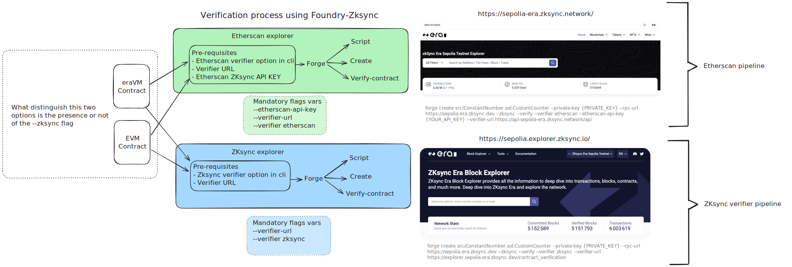

# ✅ Contract Verification using Foundry-ZkSync



You can verify both `eraVM` and `EVM` contracts using **either** the *Etherscan* pipeline or the *ZkSync* verifier pipeline.

> ⚠️ The key distinction is which pipeline you use, each requiring different CLI flags and environment variables.
> 

---

## 🧱 Contract Types

| Contract Type | Description |
| --- | --- |
| `eraVM` | ZkSync-native smart contracts |
| `EVM` | Standard Ethereum-compatible contracts |

Both types are compatible with both verification pipelines.

---

## 🔗 Verification Pipelines

### 🟢 Etherscan Pipeline

🔗 Explorer: [https://sepolia-era.zksync.network](https://sepolia-era.zksync.network/)

### 🔧 Pre-requisites:

- Use `--verifier etherscan`
- Etherscan-compatible API key
- Verifier URL

### 🧪 Required CLI flags:

```bash
--etherscan-api-key {YOUR_API_KEY}
--verifier etherscan
--verifier-url https://api-sepolia.era.zksync.network/api
```

### 🚀 Example:

```bash
forge create src/ConstantNumber.sol:CustomCounter --private-key {PRIVATE_KEY} --rpc-url https://sepolia.era.zksync.dev --zksync --verify --verifier etherscan --etherscan-api-key {YOUR_API_KEY} --verifier-url https://api-sepolia-era.zksync.network/api
```

https://sepolia-era.zksync.network/address/0x87ecb1ccea112ee9022828d36b941d6746e757e8#code

---

### 🔵 Zksync Verifier Pipeline

🔗 Explorer: [https://sepolia.explorer.zksync.io](https://sepolia.explorer.zksync.io/)

### 🔧 Pre-requisites:

- Use `--verifier zksync`
- No API key needed
- Verifier URL

### 🧪 Required CLI flags:

```bash
--verifier zksync
--verifier-url https://sepolia.explorer.zksync.io/contract_verification
```

### 🚀 Example:

```bash
forge create src/ConstantNumber.sol:CustomCounter --private-key {PRIVATE_KEY} --rpc-url https://sepolia.era.zksync.dev --zksync --verify --verifier zksync --verifier-url https://explorer.sepolia.era.zksync.dev/contract_verification
```

https://sepolia.explorer.zksync.io/address/0x6eE1025Db453465FdEA8a13b4E083279cEFDCF3f#contract

---

## 📌 Summary

| Pipeline | CLI Flag | Verifier URL | Requires API Key | Compatible With |
| --- | --- | --- | --- | --- |
| Etherscan | `--verifier etherscan` | https://api-sepolia.era.zksync.network/api | ✅ Yes | `eraVM` ✅ / `EVM` ✅ |
| ZkSync Verifier | `--verifier zksync` | https://sepolia.explorer.zksync.io/contract_verification | ❌ No | `eraVM` ✅ / `EVM` ✅ |